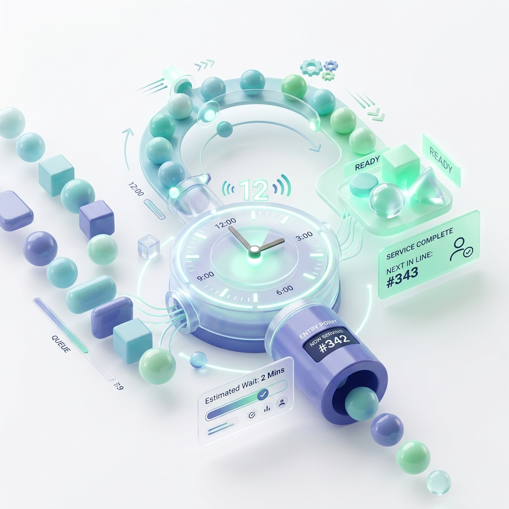



  
  
  <h1>🎯 SmartQueue</h1>
  
<strong>Next-Gen Digital Queue Management System</strong>

  
Say goodbye to waiting in physical lines. Join digitally, track your wait time in real-time, and arrive exactly when it's your turn.

## ✨ Key Features

- **📱 Remote Queuing:** Users can pull a digital token from their phone without physically standing in line.
- **⏱️ Live Tracking:** Real-time updates powered by WebSockets ensure users know exactly who is being served instantly.
- **🏢 Multi-Workplace Support:** Admins can manage multiple locations, desks, or branches from a single unified panel.
- **📊 Real-time Analytics:** Track total tokens, active sessions, and performance metrics via visual charts.
- **🔒 Enterprise-Grade Security:** Fully secured with JSON Web Tokens (JWT) and BCrypt password hashing.

## 🛠️ Tech Stack

### Frontend (Client-Side)
- **React 18** (UI Library)
- **React Router** (Navigation)
- **SockJS & STOMP** (WebSocket integration)
- **Recharts** (Data visualization)
- **Axios** (API requests)

### Backend (Server-Side)
- **Java 17 & Spring Boot 3** (Core framework)
- **Spring Security** (Authentication & Authorization)
- **Spring WebSockets** (Real-time broadcasting)
- **Spring Data MongoDB** (Database ORM)

### Database
- **MongoDB Atlas** (Cloud NoSQL Database)

---

## 🚀 Getting Started

Follow these instructions to get a copy of the project up and running on your local machine for development and testing.

### Prerequisites
- [Java Development Kit (JDK) 17+](https://www.oracle.com/java/technologies/javase/jdk17-archive-downloads.html)
- [Apache Maven](https://maven.apache.org/) (or use IntelliJ IDEA's bundled Maven)
- [Node.js](https://nodejs.org/) (v16 or higher)
- A MongoDB Atlas account/cluster

### 1. Backend Setup (Spring Boot)

1. Open the \ackend\ folder in your favorite IDE (IntelliJ IDEA is recommended).
2. Allow Maven to download all required dependencies.
3. Open \src/main/resources/application.properties\ and configure your MongoDB connection string (this is already set up if you are using the cloud database).
4. Run the \SmartQueueApplication.java\ class.
5. The backend will start on \http://localhost:8080\.

### 2. Frontend Setup (React)

1. Open a new terminal and navigate to the \rontend\ directory:
   \\\ash
   cd frontend
   \\\
2. Install the required NPM packages:
   \\\ash
   npm install
   \\\
3. Start the React development server:
   \\\ash
   npm start
   \\\
4. The application will launch in your browser at \http://localhost:3000\.

---

## 💻 Usage & Workflows

**For Users:**
1. Navigate to \http://localhost:3000/user/register\ to create an account.
2. Log in, browse active workplaces, and click **"Join Queue"**.
3. Watch your token number and wait time update in real-time as the admin serves people.

**For Admins:**
1. Navigate to \http://localhost:3000/admin/register\ to create an administrative account.
2. Create a **Workplace** (e.g., "City Hospital - Reception").
3. Start a **Session** to begin accepting users.
4. Click **"Call Next"** to serve the next user in line automatically.

---

  <i>Built with ❤️ for modern queue management.</i>

